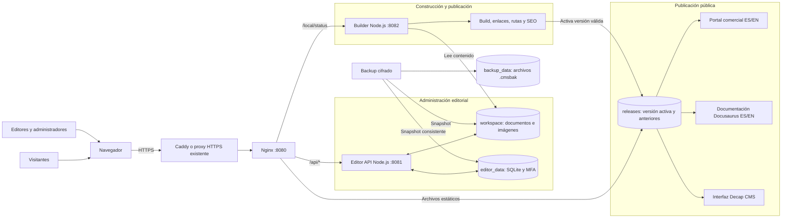
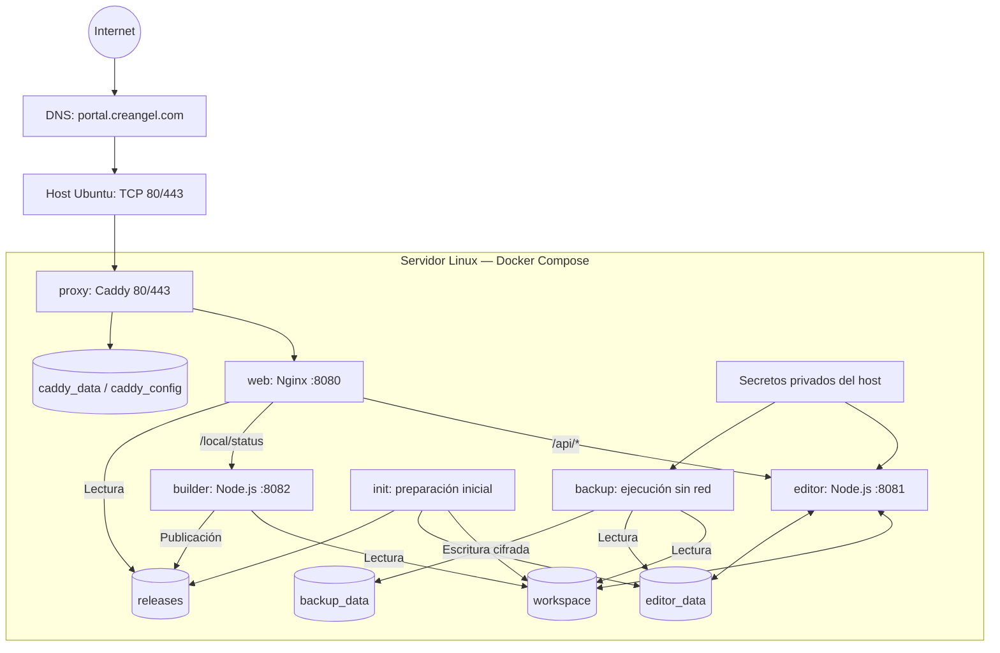
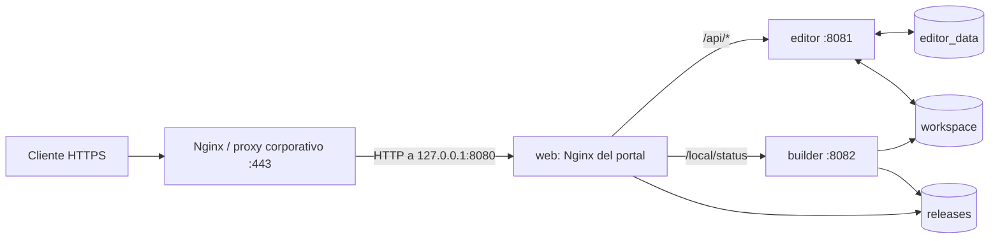
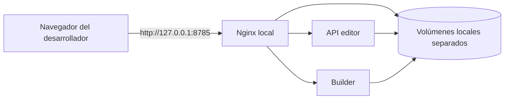
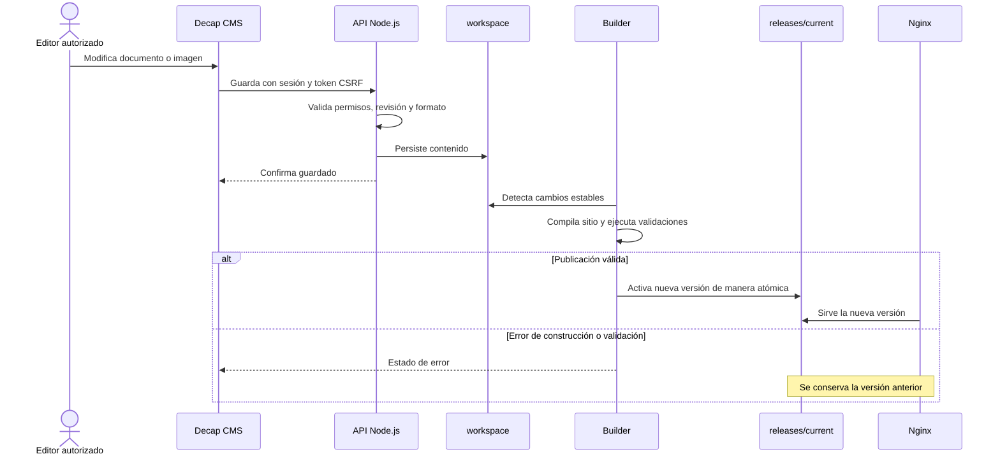

# CREANGEL — Portal corporativo, documentación IFINDIT y administración editorial

**Repositorio:** [castellanosfelipe/Landing-creangel](https://github.com/castellanosfelipe/Landing-creangel)  
**Portal previsto:** [https://portal.creangel.com](https://portal.creangel.com)  
**Tecnologías:** Docker Compose · Nginx · Caddy · Node.js · Docusaurus · Decap CMS · SQLite  
**Última revisión documental:** 9 de octubre de 2026

> **Alcance de este README:** integra descripción funcional, arquitectura lógica, topología de despliegue, instalación, seguridad, publicación, operación, respaldo, recuperación y pruebas. Se basa en el código y la configuración públicos de la rama `main`. Es una **revisión estática**: no se ejecutó ni certificó el despliegue en un servidor de producción. Los diagramas Mermaid se renderizan directamente en GitHub.

## Contenido

1. [Descripción de la solución](#1-descripción-de-la-solución)
2. [Arquitectura tecnológica](#2-arquitectura-tecnológica)
3. [Diagrama de arquitectura lógica](#3-diagrama-de-arquitectura-lógica)
4. [Diagramas de despliegue](#4-diagramas-de-despliegue)
5. [Flujo de edición y publicación](#5-flujo-de-edición-y-publicación)
6. [Estructura del repositorio](#6-estructura-del-repositorio)
7. [Instalación en Ubuntu Server 24.04](#7-instalación-en-ubuntu-server-2404)
8. [Despliegue con proxy HTTPS existente](#8-despliegue-con-proxy-https-existente)
9. [Entorno local de pruebas](#9-entorno-local-de-pruebas)
10. [Usuarios, autenticación y seguridad](#10-usuarios-autenticación-y-seguridad)
11. [Administración y mantenimiento](#11-administración-y-mantenimiento)
12. [Persistencia, respaldos y recuperación](#12-persistencia-respaldos-y-recuperación)
13. [Pruebas, validaciones y SEO](#13-pruebas-validaciones-y-seo)
14. [Variables de configuración](#14-variables-de-configuración)
15. [Solución de problemas](#15-solución-de-problemas)
16. [Recomendaciones de producción](#16-recomendaciones-de-producción)
17. [Lista de verificación](#17-lista-de-verificación)
18. [Fuentes técnicas](#18-fuentes-técnicas)

## 1. Descripción de la solución

Landing-creangel es el portal corporativo bilingüe de **CREANGEL**, con páginas comerciales y documentación técnica de **IFINDIT** en español e inglés. Además de contenido estático, incorpora un sistema local para administrar editores, documentos, imágenes y publicaciones.

### 1.1 Características principales

- Portal comercial en español (`/`) e inglés (`/en/`).
- Documentación construida con Docusaurus: `/documentacion/` y `/documentacion/en/`.
- Edición visual de contenido e imágenes mediante Decap CMS.
- API Node.js local con autenticación, autorización por roles, CAPTCHA y segundo factor administrativo.
- Base SQLite persistente para usuarios, sesiones y auditoría.
- Generación automática del portal y publicación por versiones con validaciones previas.
- Entrega de contenido mediante Nginx y HTTPS mediante Caddy o proxy corporativo existente.
- Respaldo cifrado, restauración validada y separación de datos mediante volúmenes Docker.
- Operación editorial en infraestructura propia, **sin requerir GitHub Actions, OAuth, webhooks ni repositorios remotos** para guardar y publicar.

El repositorio documenta la preservación de páginas comerciales ES/EN, contenidos de productos y rutas históricas. El CMS administra documentos editoriales ES/EN e imágenes; los cambios al diseño comercial y a los diagramas implementados en código requieren un despliegue de código.

### 1.2 Rutas de acceso

| Ruta | Propósito | Acceso |
|---|---|---|
| `/` | Portal corporativo en español | Público |
| `/en/` | Portal corporativo en inglés | Público |
| `/documentacion/` | Documentación en español | Público |
| `/documentacion/en/` | Documentación en inglés | Público |
| `/admin/login.html` | Autenticación editorial | Público, con controles de acceso |
| `/admin/` | Edición de documentos e imágenes | Editor o administrador |
| `/admin/users/` | Administración de cuentas | Administrador |
| `/api/health` | Verificación de salud de la API | Según configuración de proxy |
| `/local/status` | Estado de la última construcción | Consulta de estado |
| `/health` | Salud del sitio publicado | Según configuración de proxy |

## 2. Arquitectura tecnológica

La solución utiliza una **arquitectura de publicación estática con servicios administrativos dinámicos**: el sitio publicado se atiende como archivos desde Nginx; la edición y construcción se realizan en servicios separados.

| Capa | Tecnología | Responsabilidad |
|---|---|---|
| Portal comercial | HTML, CSS, JavaScript | Interfaz pública y páginas comerciales |
| Documentación | Docusaurus 3.10.2, React 19.2.0 | Generación de documentación ES/EN |
| CMS | Decap CMS | Interfaz de edición visual |
| API editorial | Node.js 24 | Usuarios, autenticación, archivos y permisos |
| Persistencia de cuentas | SQLite | Usuarios, sesiones, auditoría y eventos |
| Constructor | Node.js + Docusaurus | Generación, validación y activación de versiones |
| Servidor de aplicaciones web | Nginx 1.28 (unprivileged) | Archivos estáticos y reverse proxy interno |
| HTTPS integrado | Caddy 2.10.2 | TLS, proxy frontal y redirección HTTPS |
| Infraestructura | Docker Engine + Docker Compose | Contenedores, recursos, redes y volúmenes |
| Respaldos | Servicio Node.js, AES-256-GCM | Copias cifradas del contenido y cuentas |

No aparecen como requisitos de este despliegue PostgreSQL, MySQL, Redis, Kubernetes ni servicios externos de identidad. Las tecnologías y versiones anteriores corresponden a los archivos consultados y pueden evolucionar en futuras versiones.

### 2.1 Servicios Docker

| Servicio | Responsabilidad | Puerto en contenedor | Alcance |
|---|---|---:|---|
| `init` | Prepara propietarios, directorios y migraciones de volúmenes | — | Tarea temporal, sin red |
| `editor` | API de administración, contenido y cuentas | 8081 | Red Docker interna |
| `builder` | Compila y publica versiones validadas | 8082 | Red Docker interna |
| `web` | Nginx: portal y enrutamiento | 8080 | Red Docker interna; loopback en modo externo |
| `proxy` | Caddy, TLS y acceso público | 80 y 443 | Internet, modalidad integrada |
| `backup` | Snapshot y cifrado de copias | — | Sin red |

## 3. Diagrama de arquitectura lógica



**Responsabilidades:** Nginx sirve el contenido y encamina las solicitudes internas; `editor` autentica y persiste cambios; `builder` detecta contenido estable, compila, valida y activa una versión; `backup` conserva copias cifradas. Los archivos públicos se sirven desde el enlace `releases/current`.

## 4. Diagramas de despliegue

### 4.1 Producción con Caddy integrado



Los volúmenes son recursos locales de Docker, **no equipos separados**. `init` finaliza al completar la inicialización; `backup` y `init` operan sin red. Los puertos 8081 y 8082 no se publican al host.

### 4.2 Producción con proxy HTTPS existente



**Condición:** el archivo `compose.external-proxy.yaml` publica `web` solo en `127.0.0.1:8080`, por lo que el proxy externo debe ejecutarse **en el mismo servidor**. Si el proxy está en otra máquina se requiere una conexión privada diseñada expresamente; no debe exponerse 8080 a Internet.

### 4.3 Entorno local



El proyecto Compose local se denomina `creangel-local`; sus datos están separados de los de producción.

## 5. Flujo de edición y publicación



**Importante:** presionar **Guardar** en el CMS inicia el proceso de publicación, pero una nueva versión solo se activa después de pasar las comprobaciones. No existen ramas ni borradores remotos: los cambios editoriales aprobados se publican directamente. Para traducciones, se crea primero el documento español y se mantiene el identificador/ruta correspondiente en inglés.

Se validan conflictos entre revisiones concurrentes, rutas duplicadas, imágenes utilizadas y reglas de contenido. Se permiten imágenes PNG, JPEG, WebP, AVIF y GIF hasta 10 MB; el servidor aplica además controles de decodificación, dimensiones, metadatos y cuotas.

## 6. Estructura del repositorio

```text
Landing-creangel/
├── .pages/                       # Reglas y conservación de páginas comerciales
├── documentation/                # Docusaurus y documentación ES/EN
├── ops/
│   ├── backup/                   # Copia y restauración cifrada
│   ├── cms/                      # Integración/validaciones del CMS
│   ├── editor/                   # API, usuarios, sesiones y contenido
│   ├── seo/                      # Metadatos, verificación y redirecciones
│   ├── storage/                  # Inicialización, compilación y releases
│   ├── Caddyfile                 # HTTPS con Caddy
│   ├── nginx.conf                # Rutas web y reverse proxy interno
│   └── setup-secrets.mjs         # Creación inicial de secretos
├── public/                       # Portal y activos de interfaz
├── .env.example                  # Parámetros de ejemplo
├── Dockerfile                    # Construcción de imágenes por etapas
├── compose.yaml                  # Producción con Caddy
├── compose.external-proxy.yaml   # Producción detrás de proxy HTTPS existente
├── compose.local.yaml            # Pruebas locales en 127.0.0.1:8785
├── package.json                  # Scripts de construcción y pruebas
└── README.md                     # Esta documentación
```

Los datos operativos `.env`, `secrets/`, bases SQLite, dependencias instaladas y compilaciones **no deben tratarse como archivos versionados del proyecto**.

## 7. Instalación en Ubuntu Server 24.04

### 7.1 Requisitos

- Ubuntu Server 24.04 LTS o servidor Linux compatible.
- Docker Engine y Docker Compose Plugin.
- Git para obtener el código.
- DNS apuntando al servidor y TCP 80/443 disponibles **si se usa Caddy**.
- Acceso a Internet durante la instalación para descargar imágenes y dependencias.
- Acceso administrativo al servidor y un lugar privado para guardar claves y respaldos externos.

**Dimensionamiento orientativo, no benchmark:** comenzar con 4 vCPU, 8 GiB de RAM y 40 GiB libres; ajustar según tráfico y tamaño del contenido. Compose define límites específicos para cada contenedor, incluido `builder` (2 GiB por defecto).

Verificaciones iniciales:

```bash
cat /etc/os-release
getent hosts portal.creangel.com
sudo ss -lntp | grep -E ':(80|443)\b' || true
df -h
free -h
```

### 7.2 Instalar Docker Engine y Compose

En un servidor sin una instalación Docker preexistente incompatible:

```bash
sudo apt update
sudo apt install -y ca-certificates curl git
sudo install -m 0755 -d /etc/apt/keyrings
sudo curl -fsSL https://download.docker.com/linux/ubuntu/gpg \
  -o /etc/apt/keyrings/docker.asc
sudo chmod a+r /etc/apt/keyrings/docker.asc

sudo tee /etc/apt/sources.list.d/docker.sources > /dev/null <<EOF_DOCKER
Types: deb
URIs: https://download.docker.com/linux/ubuntu
Suites: $(. /etc/os-release && echo "${UBUNTU_CODENAME:-$VERSION_CODENAME}")
Components: stable
Architectures: $(dpkg --print-architecture)
Signed-By: /etc/apt/keyrings/docker.asc
EOF_DOCKER

sudo apt update
sudo apt install -y docker-ce docker-ce-cli containerd.io \
  docker-buildx-plugin docker-compose-plugin
sudo systemctl enable --now docker
sudo docker version
sudo docker compose version
```

Si el servidor ya tiene Docker, revisar su instalación antes de modificar paquetes. **No eliminar a ciegas** `docker.io`, `containerd`, `runc` o datos de contenedores que puedan pertenecer a otros servicios. El grupo local `docker` concede privilegios equivalentes a root; aquí se usa `sudo docker`.

Documentación oficial: [Docker Engine para Ubuntu](https://docs.docker.com/engine/install/ubuntu/).

### 7.3 Descargar el proyecto

```bash
sudo mkdir -p /opt/creangel
sudo chown "$USER":"$USER" /opt/creangel
cd /opt/creangel
git clone https://github.com/castellanosfelipe/Landing-creangel.git
cd Landing-creangel
git branch --show-current
git rev-parse HEAD
```

Registrar el hash del commit desplegado facilita auditoría y retroceso de código.

### 7.4 Generar credenciales y archivos privados

El script crea `.env`, `secrets/editor-admin-password` y `secrets/backup-key` si no existen. No sobrescribe credenciales previas.

```bash
cd /opt/creangel/Landing-creangel
sudo docker run --rm \
  -v "$PWD:/app" -w /app \
  node:24-bookworm-slim \
  node ops/setup-secrets.mjs
sudo ls -ld secrets
sudo ls -l .env secrets/
```

También puede ejecutarse con `node ops/setup-secrets.mjs` si Node.js 24 está instalado en el host. El script aplica permisos privados a los archivos nuevos. **No incorporar secretos a Git, imágenes Docker, capturas ni tickets.** Guardar una copia privada de `secrets/backup-key` fuera del servidor.

### 7.5 Configurar `.env`

Revisar el archivo generado; este es un ejemplo correspondiente al dominio previsto:

```dotenv
PUBLIC_SITE_URL=https://portal.creangel.com
SITE_DOMAIN=portal.creangel.com
ACME_EMAIL=soluciones@creangel.com
INITIAL_ADMIN_USERNAME=admin
EDITOR_ADMIN_PASSWORD_PATH=./secrets/editor-admin-password
BACKUP_KEY_PATH=./secrets/backup-key
AUDIT_RETENTION_DAYS=90
ALERT_RETENTION_DAYS=30
EDITOR_IDLE_MINUTES=30
BACKUP_RETENTION_DAYS=30
BACKUP_INTERVAL_HOURS=24
HTTP_PORT=80
HTTPS_PORT=443
```

`PUBLIC_SITE_URL` debe coincidir con el origen HTTPS real del navegador. El dominio y el correo deben ajustarse a la infraestructura administrada.

### 7.6 Desplegar producción con Caddy

```bash
cd /opt/creangel/Landing-creangel
sudo docker compose config --quiet
sudo docker compose up -d --build --wait
sudo docker compose ps
```

El servicio `init` puede mostrar `Exited (0)`: es el resultado esperado para una tarea de inicialización exitosa.

Comprobación inicial:

```bash
sudo docker compose logs --tail=100 proxy
sudo docker compose logs --tail=100 web
sudo docker compose logs --tail=100 editor
sudo docker compose logs --tail=100 builder
sudo docker compose logs --tail=100 backup

curl -I https://portal.creangel.com/
curl -fsS https://portal.creangel.com/api/health
curl -fsS https://portal.creangel.com/local/status
```

Para TLS automático mediante Caddy deben funcionar DNS, puertos 80/443 y conectividad exterior. No iniciar Caddy si otro proxy del mismo host ya ocupa esos puertos: use la modalidad de la sección 8.

### 7.7 Primer acceso

Abrir `https://portal.creangel.com/admin/login.html`. El usuario inicial es `admin`, a menos que se haya cambiado `INITIAL_ADMIN_USERNAME` **antes** del primer arranque. Su contraseña inicial se conserva en `secrets/editor-admin-password` y debe leerse de forma privada por un operador autorizado.

En el primer ingreso:

1. Cambiar la contraseña temporal.
2. Configurar el segundo factor TOTP del administrador.
3. Guardar los diez códigos de recuperación en un gestor privado.
4. Entrar a `/admin/users/` y crear las cuentas editoriales autorizadas.
5. Verificar una edición y la publicación de un documento de prueba.

Después del cambio, la contraseña inicial en el archivo de preparación **ya no representa la contraseña vigente**.

## 8. Despliegue con proxy HTTPS existente

Si CREANGEL ya dispone de Nginx, otro reverse proxy corporativo o un balanceador que termina HTTPS **en el mismo servidor**, usar:

```bash
cd /opt/creangel/Landing-creangel
sudo docker compose \
  -f compose.yaml \
  -f compose.external-proxy.yaml config --quiet

sudo docker compose \
  -f compose.yaml \
  -f compose.external-proxy.yaml up -d --build --wait

sudo docker compose \
  -f compose.yaml \
  -f compose.external-proxy.yaml ps

curl -I http://127.0.0.1:8080/
```

Este override evita arrancar Caddy y publica Nginx solamente en loopback. Ejemplo **parcial** para un Nginx frontal que ya dispone de certificados y una configuración TLS válida:

```nginx
server {
    listen 443 ssl;
    server_name portal.creangel.com;

    # Incorporar ssl_certificate y ssl_certificate_key reales.
    # Completar políticas TLS, WAF y logs corporativos.

    location / {
        proxy_pass http://127.0.0.1:8080;
        proxy_set_header Host $host;
        proxy_set_header X-Real-IP $remote_addr;
        proxy_set_header X-Forwarded-Proto https;
        proxy_set_header X-Forwarded-Host $host;
    }
}
```

**Advertencias:** no utilizar el bloque como configuración completa sin certificados. Reenviar todas las rutas —incluidas `/api/`, `/admin/`, `/documentacion/` y `/local/status`— al mismo backend. **Sobrescribir `X-Real-IP` con la IP del cliente**, en lugar de aceptar cabeceras enviadas por visitantes. Nunca exponer 8080/8081/8082 a Internet. Si el proxy se aloja en otro host, definir una red privada y revisar el esquema de publicación: `127.0.0.1` no alcanzará otro equipo.

## 9. Entorno local de pruebas

La definición `compose.local.yaml` crea un proyecto aislado en `127.0.0.1:8785`, con sus propios volúmenes:

```bash
# Solo si aún no existen los secretos:
sudo docker run --rm \
  -v "$PWD:/app" -w /app \
  node:24-bookworm-slim node ops/setup-secrets.mjs

sudo docker compose \
  -f compose.local.yaml \
  up -d --build --remove-orphans --wait

sudo docker compose -f compose.local.yaml ps
curl -I http://127.0.0.1:8785/
```

Accesos: `http://127.0.0.1:8785/` y `http://127.0.0.1:8785/admin/login.html`. El entorno local impide indexación y no debe abrirse públicamente; para administrarlo desde otro equipo se recomienda un túnel SSH autorizado.

## 10. Usuarios, autenticación y seguridad

### 10.1 Modelo de roles y sesiones

- **Editor:** modifica documentos e imágenes y su propia contraseña.
- **Administrador:** gestiona cuentas, contraseñas, roles, activación/desactivación y eventos de auditoría.
- No existe autorregistro público; la API aplica autorización además de los controles visuales del CMS.
- No puede desactivarse o degradarse el último administrador activo.
- Cambiar permisos, desactivar usuarios o restablecer contraseñas revoca sesiones.
- Las sesiones duran como máximo 8 horas o 30 minutos de inactividad por defecto.

### 10.2 Controles implementados o documentados

| Control | Comportamiento documentado |
|---|---|
| Contraseñas | 15–128 caracteres; derivación scrypt con sal individual |
| Sesiones | Cookies `HttpOnly`, `SameSite=Strict` y `Secure` en HTTPS |
| CAPTCHA | Imagen local de cinco caracteres con vigencia y un solo uso |
| Segundo factor | TOTP local obligatorio para administradores después del primer cambio |
| Recuperación MFA | Diez códigos de recuperación de un solo uso |
| Solicitudes de escritura | Sesión válida, comprobación de origen y token CSRF |
| Medios | Validación de tipo, tamaño, decodificación y limpieza de metadatos |
| Contenedores | Raíz de solo lectura, eliminación de capacidades y límites de recursos |
| Navegador | CSP y otros encabezados de seguridad configurados en Nginx |
| Bitácora | Eventos de seguridad sin contraseñas ni códigos; rotación de logs Docker |
| API | Limitación de peticiones y conexiones; límites de tamaño |

El archivo `editor_data/mfa.key` acompaña a SQLite y es necesario para recuperar correctamente los secretos TOTP cifrados. Las operaciones administrativas sensibles pueden requerir reconfirmación de contraseña y segundo factor.

**Límite de la evaluación:** la presencia de estas medidas en el repositorio no constituye una auditoría de penetración ni garantiza ausencia de vulnerabilidades. Para producción es recomendable restringir la administración por VPN, políticas de acceso o controles perimetrales compatibles con el CMS.

## 11. Administración y mantenimiento

### 11.1 Estado y registros

```bash
sudo docker compose ps
sudo docker compose logs --tail=100 editor
sudo docker compose logs --tail=100 builder
sudo docker compose logs --tail=100 web
sudo docker compose logs --tail=100 proxy
sudo docker compose logs --tail=100 backup
```

Estado directo del constructor desde el contenedor:

```bash
sudo docker compose exec builder node -e \
  "fetch('http://127.0.0.1:8082/status').then(r=>r.json()).then(console.log)"
```

Si una edición produce un error de construcción, corregir el contenido y guardar de nuevo. En determinados fallos puede reintentarse al reiniciar el constructor:

```bash
sudo docker compose restart builder
```

### 11.2 Actualización de código

Antes de actualizar: generar y verificar respaldo, registrar commit actual, revisar cambios e implementar una ventana de mantenimiento.

```bash
cd /opt/creangel/Landing-creangel
git status --short
git rev-parse HEAD
git pull --ff-only origin main
sudo docker compose config --quiet
sudo docker compose up -d --build --remove-orphans --wait
sudo docker compose ps
```

La actualización mantiene volúmenes **si no se eliminan**. No usar `docker compose down -v` en mantenimiento ordinario: puede destruir documentos, cuentas, auditoría, respaldos y publicaciones.

En modalidad de proxy externo, repetir la misma combinación de archivos `-f compose.yaml -f compose.external-proxy.yaml` durante las actualizaciones.

### 11.3 Recursos y observabilidad

```bash
sudo docker stats --no-stream
sudo docker system df
sudo docker volume ls | grep creangel
sudo docker compose logs --since=1h --tail=200
```

Supervisar consumo de RAM del constructor, espacio de volúmenes, errores HTTP, resultados de publicación, disponibilidad y vigencia de certificados. Los logs locales Docker no sustituyen una plataforma corporativa de observabilidad.

## 12. Persistencia, respaldos y recuperación

### 12.1 Volúmenes

| Volumen | Contenido | Tratamiento |
|---|---|---|
| `workspace` | Documentos e imágenes editoriales | Persistente; respaldar |
| `editor_data` | SQLite, sesiones, auditoría y `mfa.key` | Privado; respaldar |
| `releases` | Versiones publicadas y enlace activo | Persistente; reconstruible en parte |
| `backup_data` | Archivos cifrados `.cmsbak` | Replicar fuera del host |
| `caddy_data` | Datos y certificados TLS | Proteger según política TLS |
| `caddy_config` | Estado/configuración Caddy | Proteger según política TLS |

El repositorio Git **no** contiene las ediciones guardadas mediante el CMS ni la base de cuentas. Copiar solamente el código no permite recuperar todo el servicio.

### 12.2 Copia cifrada

El servicio de respaldo crea por defecto una copia cada 24 horas y retiene 30 días. Incluye contenido ES/EN, imágenes, snapshot consistente de SQLite y `mfa.key`. El archivo se cifra con AES-256-GCM; **sin `secrets/backup-key` no podrá recuperarse**.

```bash
sudo docker compose exec backup \
  node /app/ops/backup/service.mjs --once
sudo docker compose logs --tail=50 backup
```

Los archivos `.cmsbak` deben transferirse periódicamente a un destino externo privado con retención, permisos y comprobaciones de integridad. Una copia en otro volumen **del mismo servidor** no protege frente a pérdida del host.

### 12.3 Restauración de prueba sin sobrescribir producción

Sustituir `backup-NOMBRE.cmsbak` por el nombre real de una copia:

```bash
sudo docker compose run --rm --no-deps backup \
  node /app/ops/backup/service.mjs restore \
  /var/lib/backups/backup-NOMBRE.cmsbak \
  /var/lib/backups/restauracion-nueva
```

La utilidad restaura en un directorio que no exista y comprueba autenticidad, integridad, rutas y base SQLite. Genera carpetas `content/` y `accounts/` (incluido `mfa.key`). **No reemplaza automáticamente la aplicación activa.** Antes de aplicar una restauración real, detener los servicios, preservar los datos originales, restaurar en un proyecto aislado y verificar propietarios/permisos (UID/GID 1000) antes de reconstruir.

### 12.4 Recuperar la contraseña administrativa

Un operador con acceso legítimo al servidor puede crear previamente un archivo privado `/ruta/privada/nueva-contrasena` y ejecutar, sin pasar la contraseña como argumento:

```bash
sudo docker compose exec -T editor sh -c \
  'umask 077; cat > /tmp/creangel-recovery-password' \
  < /ruta/privada/nueva-contrasena

sudo docker compose exec editor node /app/ops/editor/cli.mjs \
  reset-password admin --password-file /tmp/creangel-recovery-password

sudo docker compose exec editor rm /tmp/creangel-recovery-password
```

Cambiar `admin` si el usuario administrador es otro. Se invalidan sesiones anteriores y se exige actualización de contraseña al iniciar sesión.

Si también se pierde el autenticador y los códigos de recuperación, el operador autorizado puede reiniciar el segundo factor para volver a enrolarlo:

```bash
sudo docker compose exec editor node /app/ops/editor/cli.mjs \
  reset-mfa admin --confirm admin
sudo docker compose exec editor node /app/ops/editor/cli.mjs security-status
```

Estos comandos requieren acceso al host y **no están expuestos por HTTP**.

## 13. Pruebas, validaciones y SEO

Para ejecutar las pruebas **fuera de Docker**, instalar Node.js 24 y Python 3:

```bash
npm ci --no-audit --no-fund
npm --prefix documentation ci --no-audit --no-fund
npm test
npm run test:dependencies
npm run test:cms
npm run build:production -- --output _site --base-url https://portal.creangel.com
python3 ops/seo/check.py \
  --root _site \
  --base-url https://portal.creangel.com \
  --report seo-validation.json
python3 ops/seo/generate-redirects.py --check
```

Las pruebas del repositorio abarcan validaciones de cuentas, autenticación, CAPTCHA, CSRF, autorizaciones, CMS, dependencias y publicación. La generación SEO verifica metadatos, enlaces, redirecciones, rutas y atributos de internacionalización. Un servidor puramente estático **no reemplaza** la API y persistencia necesarias para el CMS.

Las rutas administrativas y otros destinos no indexables deben mantenerse fuera de los resultados de búsqueda. Las pruebas locales no certifican el funcionamiento real de DNS, HTTPS, WAF, certificados, red, permisos del host ni restauración ante desastre.

### 13.1 Consideración sobre dependencias

El README original del proyecto informa de un parche reproducible para el aviso asociado a `braces@3.0.3` en documentación. Deben mantenerse ejecutables `npm audit`, `npm run test:dependencies` y los controles de cambio de versión; un parche local **no equivale** a una corrección oficial publicada por el proveedor.

## 14. Variables de configuración

| Variable | Valor de referencia | Uso |
|---|---|---|
| `PUBLIC_SITE_URL` | `https://portal.creangel.com` | Origen oficial del sitio y enlaces |
| `SITE_DOMAIN` | `portal.creangel.com` | Nombre DNS utilizado por Caddy |
| `ACME_EMAIL` | `soluciones@creangel.com` | Contacto ACME/TLS |
| `INITIAL_ADMIN_USERNAME` | `admin` | Nombre de la cuenta inicial |
| `EDITOR_ADMIN_PASSWORD_PATH` | `./secrets/editor-admin-password` | Archivo secreto de la contraseña inicial |
| `BACKUP_KEY_PATH` | `./secrets/backup-key` | Clave privada de cifrado de backups |
| `EDITOR_IDLE_MINUTES` | `30` | Cierre por inactividad |
| `AUDIT_RETENTION_DAYS` | `90` | Retención de eventos de auditoría |
| `ALERT_RETENTION_DAYS` | `30` | Retención de alertas |
| `BACKUP_INTERVAL_HOURS` | `24` | Frecuencia de respaldo |
| `BACKUP_RETENTION_DAYS` | `30` | Retención local de copias |
| `HTTP_PORT` | `80` | Puerto HTTP de Caddy |
| `HTTPS_PORT` | `443` | Puerto HTTPS de Caddy |

Existen variables opcionales de recursos como `EDITOR_MEMORY_LIMIT`, `BUILDER_MEMORY_LIMIT`, `BUILDER_CPU_LIMIT`, `BACKUP_MEMORY_LIMIT`, así como `WEB_LOCAL_PORT` para el modo con proxy externo y `LOCAL_PORT` para pruebas locales. Verificar siempre los valores efectivos con `docker compose config`.

## 15. Solución de problemas

| Síntoma | Comprobación | Acción sugerida |
|---|---|---|
| El portal no abre | DNS, firewall, `docker compose ps` | Verificar 80/443 y logs del servicio frontal |
| Caddy no obtiene certificado | DNS, puerto 80/443, logs de `proxy` | Resolver acceso ACME o usar proxy HTTPS existente |
| `editor` falla al iniciar | `docker compose logs editor` | Revisar secretos, permisos y migraciones `init` |
| La web muestra contenido anterior | `/local/status`, logs de `builder` | Corregir build; verificar que se activó `releases/current` |
| Error al guardar documento | Sesión, CSRF, rol, validación y revisión del archivo | Recargar si hubo edición concurrente; corregir contenido |
| Errores 502 en `/api/` | Salud de `editor`, configuración Nginx | Revisar red interna y logs |
| La administración rechaza sesiones | Hora, cookies HTTPS, `PUBLIC_SITE_URL`, CAPTCHA/TOTP | Revisar origen y configuración de HTTPS |
| El proxy corporativo identifica mal las IP | Encabezado `X-Real-IP` y acceso a 8080 | Sobrescribir cabecera y cerrar exposición externa |
| Falló el respaldo | Logs `backup`, espacio, clave y permisos | Corregir y generar nueva copia verificada |
| Archivos o cuentas desaparecen tras reinstalar | Inventario de volúmenes, uso de `down -v` | Recuperar backups; nunca eliminar volúmenes sin plan |

Para incidencias de producción no compartir en tickets contraseñas, claves, cookies, archivos SQLite ni copias descifradas.

## 16. Recomendaciones de producción

| Prioridad | Área | Recomendación |
|---|---|---|
| Alta | Continuidad | Transferir respaldos cifrados fuera del servidor y ensayar restauraciones |
| Alta | Seguridad | Proteger claves privadas, `editor_data`, volúmenes y acceso administrativo |
| Alta | Red | Mantener 8080/8081/8082 fuera de Internet; aplicar TLS y cabeceras correctas |
| Alta | Actualización | Respaldar antes de cambiar código; no eliminar volúmenes |
| Media | Observabilidad | Centralizar logs, métricas y alertas de disponibilidad y publicaciones |
| Media | Disponibilidad | Documentar recuperación en otro host y definir RPO/RTO |
| Media | Rendimiento | Medir memoria del builder, tiempos de compilación y Core Web Vitals |
| Media | Dependencias | Ejecutar pruebas y revisar avisos de seguridad antes de actualizar |
| Media | Procesos editoriales | Definir revisión de contenidos sensibles antes de Guardar/publicar |

Este despliegue describe una **instalación en un solo host**, no un clúster de alta disponibilidad. Una arquitectura multinodo, balanceo entre servidores o replicación activa requeriría un diseño adicional de persistencia y publicación.

## 17. Lista de verificación

**Instalación y acceso**

- [ ] Docker Engine y Compose funcionan.
- [ ] El repositorio se obtuvo y se registró el commit.
- [ ] `.env`, contraseña inicial y clave de respaldo se generaron con permisos privados.
- [ ] El DNS resuelve correctamente y TLS es válido.
- [ ] El portal, documentación ES/EN y panel administrativo responden.
- [ ] `editor`, `builder`, `web`, `proxy` (si aplica) y `backup` están saludables.

**Administración y publicación**

- [ ] Se cambió la contraseña del administrador inicial.
- [ ] Se configuró TOTP y se guardaron los códigos de recuperación.
- [ ] Se probaron los permisos de editor y administrador.
- [ ] Un contenido de prueba se publica después de superar las validaciones.
- [ ] Una compilación fallida conserva la versión pública anterior.

**Seguridad y continuidad**

- [ ] No hay acceso externo a puertos privados ni a datos sensibles.
- [ ] El proxy externo, si existe, sobrescribe `X-Real-IP` correctamente.
- [ ] Los datos persisten tras reiniciar los contenedores.
- [ ] Se generó un `.cmsbak` y se transfirió fuera del host.
- [ ] Se realizó una restauración de prueba independiente.
- [ ] Las pruebas de aplicación, CMS, dependencias y SEO pasan correctamente.
- [ ] Se definieron monitoreo, responsables y procedimiento de recuperación.

## 18. Fuentes técnicas

- [Repositorio Landing-creangel](https://github.com/castellanosfelipe/Landing-creangel)
- [README original del proyecto](https://github.com/castellanosfelipe/Landing-creangel/blob/main/README.md)
- [Compose de producción](https://github.com/castellanosfelipe/Landing-creangel/blob/main/compose.yaml)
- [Compose con proxy externo](https://github.com/castellanosfelipe/Landing-creangel/blob/main/compose.external-proxy.yaml)
- [Compose local](https://github.com/castellanosfelipe/Landing-creangel/blob/main/compose.local.yaml)
- [Dockerfile](https://github.com/castellanosfelipe/Landing-creangel/blob/main/Dockerfile)
- [Configuración Nginx](https://github.com/castellanosfelipe/Landing-creangel/blob/main/ops/nginx.conf)
- [Configuración Caddy](https://github.com/castellanosfelipe/Landing-creangel/blob/main/ops/Caddyfile)
- [Script de secretos](https://github.com/castellanosfelipe/Landing-creangel/blob/main/ops/setup-secrets.mjs)
- [API de edición](https://github.com/castellanosfelipe/Landing-creangel/blob/main/ops/editor/server.mjs)
- [Constructor de versiones](https://github.com/castellanosfelipe/Landing-creangel/blob/main/ops/storage/worker.mjs)
- [Instalación oficial Docker Engine para Ubuntu](https://docs.docker.com/engine/install/ubuntu/)

---

**Nota de mantenimiento:** actualizar este README cuando cambien el código, las versiones, las rutas, los secretos, las variables de entorno o el modo de publicación. Las instrucciones representan la configuración revisada el **9 de octubre de 2026** y no reemplazan una validación operativa del entorno de destino.
